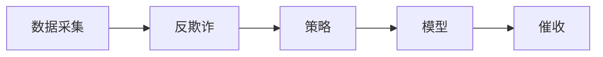

# 金融风控概述

- PreA使用不花钱的数据，降低成本
- 四要素：手机号身份证银行卡姓名
- 反欺诈：欺诈名单

> 最开始的信贷风控是怎么做的?

人审: 吃业务经验不能大批量处理，效率低下不适用于移动互联网时代的金融场景。

> 有分数刻度的好处

我们可以随时根据业务需求调整通过率更容易向用户解释他的信用
评级更容易向领导解释一个用户被拒绝的原因更容易监控一个模型的效果

> 风控流程

风控的角度来看，基本上可以归结为以下几个部分:

> 数据采集

数据采集会涉及到埋点和爬虫技术，基本上业内的数据都大同小异。
免费的运营商数据、和安卓可爬的手机内部信息(app名称，
手机设备信息，部分app内容信息)、以及收费的征信数据、
各种信息校验、外部黑名单之类的。还有一些特定场景的现金贷和消费金融会有自有的数据可供使用，
比如阿里京东自己的电商数据、滴滴的司机数据、顺丰中通的快递数据等等。
由于不涉及爬虫，这一块主要让大家理解一下都可以做些什么变量。

> 反欺诈引擎

反欺诈引擎主要包括两个部分，反欺诈规则和反欺诈模型。
这里其实很少使用传统监督模型。涉及到的算法以无监督算法、
社交网络算法、深度学习居多。大部分的公司都使用的是反欺诈规则，
这也是主要提倡的。一个原因是欺诈标签不好得到，很难做监督学习的训练。
还有一个原因是传统的机器学习对欺诈的检测效果很差。
因为所谓欺诈，就是一些黑产或者个人将自己包装成信用良好的用户，
进行借款后失联或者拒不还钱。既然都伪装成了好客户，
基于风控人员主观思考建立的统计模型，又怎么可能有好的效果。
但是经过一段时间的实验，这一块其实用深度学习反而有意想不到的效果，
基本思想可以理解为，简单评分卡解释性强，带来的坏处就是可以被逆向破解，
而复杂模型的黑箱操作虽然解释性差，却有一定的安全性，
尤其是搭配了在线学习等动态手段之后。反向破解的成本极高。
此外还有很多算法诸如异常检测和知识图谱都在这一块有所应用。

> 规则引擎

规则引擎其实就是我们常说的策略，主要通过数据分析、
挖掘手段以及一些监督、无监督算法，得到不同字段、各个区间的坏账率(badrate)，
找到最佳分段区间，然后得到筛选后信用较好的一批特定人群进行放款。
这一块主要有单变量分析和一些关键指标的计算和监控，
比如Rollrate、PSI、KS、AUC，等等。通常规则和模型是组合使用的，尤其在反欺诈场景中。

> 风控模型

风控模型是机器学习在风控领域的主要体现。当然前面提到的反欺诈模型也是重点之一。
主要是通过监督算法构建违约概率预测模型。但是因为实际业务中，
是数据的质量并不是永远那么完美，这里通常我们会使用到深度学习、无监督、
弱监督等等方法去辅助传统监督学习算法。

风控模型其中包含了A/B/C卡。模型算法之间可以没有显著区别，
而是根据其发生的时间点不同而进行划分的(贷前/贷中/贷后)，也就是y产生的方式不一样。
通常信贷领域都是用逾期天数来定义y。

- `A`卡可以用客户历史逾期天数最大的天数。
- `B`卡则可以多期借款中逾期最大的一次。
- `C`卡因为用途不同有不同的建立方法。

比如你们公司有内催，有外催。外催肯定是回款率低，单价贵的。那么就可以根据是否被内催催回来定义y。

> 催收

催收是风控的最终手段。
这个环节可以产生很多对模型有帮助的数据。
比如催收记录的文字描述、触达率、欺诈标签等等。
并且坏账的客户会被列入黑名单。其实只要是能被催回来的，都不是坏账。
但是很多公司为了保险起见，逾期超过一定时间的客户，即使被催回来，
也会被拉入黑名单。这里主要的算法就是催收模型相关的，可能是监督、无监督算法。
也有基于社交网络算法构造的失联模型等等。

> 几个概念

- `Badrate`: 坏人占比
- `MOB(monthonbook)`: 开卡时长
- `Vintage`分析法是一种动态分析法，用来分析不同时期资产的表现情况，它以贷款的账龄为基础，
观察每批放款贷后`1,2,3...N`个月时的逾期情况。
- `Roll-Rate`分析追溯贷款状态之间每月的迁移情况，展示了每批贷款进入下一个逾期状态的概率。
pd1 / pd7 pass due 7
M0 / M1 / M2 / M3 / M4 ~ 15day ~ 逾期

> 贷款指标

1. 逾期天数`DPDn`(days past due)：自应还日次日起到实还日期间的日期数，DPD30表示逾期30天；
2. 逾期期数：自应还日次日起到实还日期间的还款期数，正常资产用C表示，Mn表示逾期n期；
3. 贷款余额`ENR`：至某时点借款人尚未偿还的本金，即全部剩余本金作为贷款余额；
4. 月均贷款余额
    - 月均贷款余额 =（月初贷款余额+月末贷款余额）/2，月初贷款余额即上月末贷款余额
5. 核销金额：贷款逾期`M7`后经审核进行销账，核销金额即在核销日期当天的贷款余额；
6. 回收金额：来自历史所有已核销合同的全部实收金额；
7. 净坏账 = 当月新增核销金额 - 当月回收金额；
8. 在账月份`MOBn`：放款后的月份，MOB0放款日至当月月底，MOB1：放款后第二个当月月底
9. 滚动率
    - `c-m1`：当月进入M1的贷款余额/上月末的贷款余额
    - `m2-m3`：当月进入M3的贷款余额/上月末M2的贷款余额

（10）逾期率

coin(c)%, coin(m1)%,

coin(m2)% 当月不同逾期期数的贷款余额/当月底总贷款余额

coin(c)%: 当月c贷款余额/当月底贷款余额（c-m6）

coin(m1)%: 当月m1贷款余额/当月底贷款余额（c-m6）

coin(m1+)%: 当月(m1-m6)贷款余额/当月底贷款余额（c-m6）

（11）逾期率：Lagged(m1)%

当月不同逾期期数的贷款余额/往前推N个月的总贷款余额

Lagged(M1)%=当月M1的贷款余额/上个月底贷款余额

Lagged(M4)%=当月M4的贷款余额/往前推四期的总贷款余额

Lagged(M4+)%=当月M4的贷款余额/往前推四期的总贷款余额+
当月M5的贷款余额/往前推五期的总贷款余额+当月M6的贷款余额/往前推六期的总贷款余额

---

> 参考书籍与文献

- 《概率论与数理统计第四版(浙大)》《统计学习方法第二版(李航)》
- 《机器学习(周志华)》
- 《利用python进行数据分析(第二版)》OR《TheLittleSASBook》
- 《信用评分模型》
