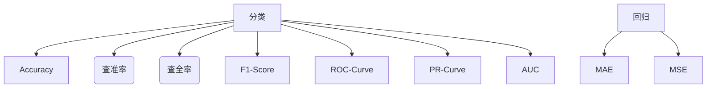

#! https://zhuanlan.zhihu.com/p/431841825


# 模型评估

> 机器学习效果评估



**混淆矩阵**

- True Positive(真正，TP)：将正类预测为正类数
- True Negative(真负，TN)：将负类预测为负类数
- False Positive(假正，FP)：将负类预测为正类数误报 (Type I error)
- False Negative(假负，FN)：将正类预测为负类数→漏报 (Type II error)

> 

- 查准率（精确度）：衡量被预测为正例的示例中实际为正例的比例。

$$
Precision = \frac{TP}{TP + FP}
$$

- 查全率（召回率）：度量有多个正例被分为正例，衡量模型覆盖面。

$$
Recall = \frac{TP}{TP + FN}
$$

**Precision-Recall 平衡**

- 分类阈值（$Threshold$）：分类边界值 $score > threshold$ 时分类为 $1$，$score < threshold$ 时分类为 $0$；
    - 阈值增大，精准率提高，召回率降低；
    - 阈值减小，精准率降低，召回率提高；

- $Precision-Recall$ 曲线

```python
from sklearn.metrics import precision_recall_curve
```

<center>

</center>

- 外层曲线对应的模型更优；或者称与坐标轴一起包围的面积越大者越优。
- 平衡点（BEP）是查准率=查全率时的取值，如果这个值较大，说明模型效果越好。
- $P - R$ 曲线也可以作为选择算法、模型、超参数的指标；
但一般不适用此曲线，而是使用 $ROC$ 曲线。

**在不平衡数据集上，假设 $Negative$ 样本远大于 $Positive$ 若 $FP$ 很大，
即有很多 $N$ 的 $sample$ 被预测为 $P$，
因为 $FPR = \frac{FP}{N_c}$，因此 $FPR$ 的值仍然很小（如果利用 $ROC$ 
曲线则会判断其性能很好，但是实际上其性能并不好），但是如果利用PR，
因为Precision综合考虑了TP和FP的值，因此在极度不平衡的数据下
（Positive的样本较少），PR曲线可能比ROC曲线更实用。**

> AUC 

Area Under Curve，就是ROC曲线下方的面积。可以知道，
TPR越大的情况下，FPR始终很小，
才是好的，那么这条曲线就是很靠近纵轴的曲线，
那么下方面积就大。AUC面积越大，说明算法和模型准确率越高越好，
反映出正样本的预测结果更加靠前。

- $ROC$ 曲线则能够更加稳定地反映模型本身的好坏。
- $P-R$ 曲线则能够更直观地反映其性能。
当正负样本比例失调时，比如正样本1个，负样本100个，则ROC曲线变化不大，
此时用PR曲线更加能反映出分类器性能的好坏。这个时候指的是两个分类器，
因为只有一个正样本，所以在画auc的时候变化可能不太大；但是在画PR曲线的时候，
因为要召回这一个正样本，看哪个分类器同时召回了更少的负样本，
差的分类器就会召回更多的负样本，这样precision必然大幅下降，
这样分类器性能对比就出来了。

> 其他模型评价指标

**考虑：**
- 计算速度：分类器训练和预测需要的时间；
- 鲁棒性：处理缺失值和异常值的能力；
- 可扩展性：处理大数据集的能力；
- 可解释性：分类器的预测标准的可理解性。

----
参考文章：

- [机器学习评估指标](https://blog.csdn.net/quiet_girl/article/details/70830796)
- [分类模型的评估指标](https://blog.csdn.net/yeler082/article/details/80279941)
