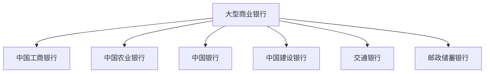
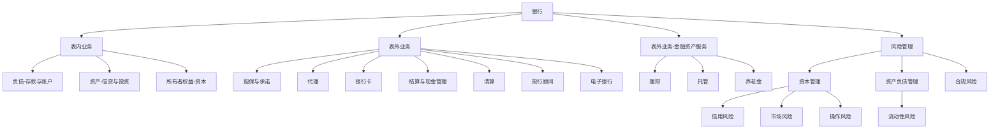

# 银行基本信贷概念

---

> 我国银行分类

根据银监会统计数据披露口径和监管职能的划分，我国银行业金融机构主要可以分为五大类，即大型商业银行（6家）、股份制商业银行（12家）、城市商业银行（130+家）、农村金融机构（130+家）和其他类金融机构。

注：
1. 农村金融机构包括农村商业银行、农村合作银行、农村信用社和新型农村金融机构。
2. 其他类金融机构包括政策性银行及国家开发银行、民营银行、外资银行、非银行金融机构、金融资产投资公司。
3. 自2019年起，邮政储蓄银行纳入“商业银行合计”和“大型商业银行”汇总口径。
4. 自2020年起，金融资产投资公司纳入“其他类金融机构”和“银行业金融机构”汇总口径。
5. 外资银行资本充足率不含外国银行分行。
6. 2014年二季度起，工商银行、农业银行、中国银行、建设银行、交通银行和招商银行等六家银行经核准开始实施资本管理高级方法，其余银行仍沿用原方法。

> 小额贷款公司与消费金融公司

**小额贷款公司**

是指由自然人、企业法人与其他社会组织投资设立，不吸收公众存款，经营小额贷款业务的有限责任公司或股份有限公司。

**消费金融公司**

是指经中国银行业监督管理委员会批准，在中华人民共和国境内设立的，不吸收公众存款，
以小额，分散为原则，为中国境内居民个人提供以消费为目的的贷款的非银行金融机构。
消费金融公司名称中应当标明“消费金融”字样。未经银监会批准，任何机构不得在名称中使用“消费金融”字样。
银行业监督管理机构依法对消费金融公司及其业务活动实施监督管理。

两者最大的区别是**小额贷款公司不是金融机构**，由各地政府的金融办监管。**消费金融公司属非银行金融机构**，
归央行和银监会监管，另外金融机构可以享受同行业拆借，可以纳入央行征信系统等优待政策。

**2021消费金融公司TOP20（全30家）**

|RK |	公司	|核心持股股东|
|---|-------|-------------|
|1	|   招联消费金融|	招商永隆银行51.94%、中国联通36.95%、招商银行11.11%|
|2	|   马上消费金融|	重庆百货31.06%、北京中关村科金技术29.51%、物美控股17.26%、重庆银行15.53%|
|3	|   兴业消费金融|	兴业银行66%、泉州商业集团24%|
|4	|   捷信消费金融|	捷信集团100%|
|5	|   中邮消费金融|	中国邮政储蓄银行70.5%、DBS星展银行15%|
|6	|   中原消费金融|	中原银行65%、上海伊千网络35%|
|7	|   杭银消费金融|	杭州银行35%、迪润（天津）科技有限公司33%、中国银泰投资有限公司20%|
|8	|   平安消费金融|	中国平安保险集团30%、融熠有限公司28%、未鲲（上海）科技服务有限公司27%|
|9	|   中银消费金融|	中国银行42.80%、百联集团22.07%、陆家嘴金融13.34%、中银信用卡13.23%|
|10 |	哈银消费金融|	哈尔滨银行53%、度小满科技30%|
|11 |	小米消费金融|	小米通讯技术有限公司50％，重庆农村商业银行股份有限公司持股30％|
|12 |	陕西长银消费金融|	长安银行51%、汇通信诚租赁25%、北京意德辰翔投资24%|
|13 |	海尔消费金融|	海尔集团30%、红 星美凯龙25%、海尔集团财务19%、浙江逸荣投资16%|
|14 |	尚诚消费金融|	上海银行38%、携程37.5%、深圳德远益信投资12.5%、无锡长盈科技12%|
|15 |	阳光消费金融股|	中国光大银行60%，王道银行、大陆中青旅控股公司分别参股20%|
|16 |	湖北消费金融|	湖北银行50%、TCL集团20%、武汉武商集团15%、武汉商联集团15%
|17 |	华融消费金融|	中国华融资产管理70%、合肥百货15%|
|18 |	长银五八消费金融|	长沙银行51%、北京城市网邻信息技术33%、长沙通程控股16%|
|19 |	北银消费金融|	北京银行35.29%、桑坦德消费金融20%、利时集团15%|
|20 |	中信消费金融|	中国中信35.1%、中信信托34.9%、金蝶软件30%|

**资金来源**

- 一是接受股东和股东境内子公司存款；
- 二是向境内金融机构借款；
- 三是发行金融债券；
- 四是境内同业拆借；
- 五是资产证券化等。
- 其中，金融机构借款和同业拆借是目前消费金融公司主要的融资手段。

> 银行业务种类

> 放松银根

放松银根是一国的中央银行或货币当局为阻止经济衰退，通过增加信贷供给，降低利率促使投资增加，促进经济增长的货币松动政策。

1. 公开市场业务。

公开市场业务是中央银行通过在金融市场上买卖政府证券，来增加或减少货币供应量的一种货币政策工具。当一国经济周期处于衰退阶段时，中央银行通常在公开市场上买进政府证券。由此产生的后果： 一是商业银行卖出政府证券，准备金增加，从而增强商业银行的信贷供给能力，增加了贷币供给; 二是促进公开市场上证券价格的上涨，利率下降，刺激投资增长，从而对企业的贷款增加，导致货币供给增加。

2. 调整法定存款准备率。

通常是调整法定存款准备率，减少商业银行的准备金数量，扩大它们的信贷能力，从而增加货币供应量。

3. 调整再贴现率。

中央银行通常调低对商业银行的票据再贴现率，商业银行可发放资金增大，贷款利率下降，投资增加，从而达到增加货币供给的目的。

上述三种货币政策工具的应用在阻止一国经济衰退时，有时是非常成功地达到预期目的。但有时也存在问题，主要是投资的利率弹性不大，中央银行要实现一定数量投资额的增加，通常要大幅度地降低利率，成本较高。

> 一般经济分析

> 小微金融政策文件

**附则部分可以衍生一些特征**
1. [《商业银行小企业授信工作尽职指引（试行）》](http://www.gov.cn/zhengce/2016-05/24/content_5076292.htm)
**小微企业的一些银行政策**
2. [《银行开展小企业授信工作指导意见》](http://www.gov.cn/zhengce/2016-05/24/content_5076299.htm)
**小微企业画型标准**
3. [《统计上大中小微型企业划分办法（2017）》](http://xwqy.gsxt.gov.cn/mirco/regu_info)
4. [《金融业企业划型标准规定》](http://xwqy.gsxt.gov.cn/mirco/regu_info)
**文件清理**
5. [《中国银监会关于规范性文件清理结果的公告》](http://www.cbirc.gov.cn/cn/view/pages/ItemDetail.html?docId=265844&itemId=861&generaltype=1)
**企业登记注册类型**
6. [《关于划分企业登记注册类型的规定调整的通知》（国统字〔2011〕86号）](http://www.gov.cn/zwgk/2011-11/17/content_1995548.htm#)
7. [《关于“个体经营”登记注册类型分类及代码的通知》（国统办字〔1999〕2号）](http://tjj.beijing.gov.cn/zwgkai/tjbz_31390/qttjfl_31393/202002/t20200214_1631951.html)
**国民经济行业分类**
8. [《关于执行国民经济行业分类第1号修改单的通知》](http://www.stats.gov.cn/tjsj/tjbz/201905/t20190521_1666107.html)
9. [《2017国民经济行业分类注释》（按第1号修改单修订）](http://www.stats.gov.cn/tjsj/tjbz/201905/t20190522_1666232.html)

**财税**
10. [关于创业投资企业和天使投资个人有关税收政策的通知](http://www.chinatax.gov.cn/n810341/n810755/c3453868/content.html)
11. [关于实施小微企业普惠性税收减免政策的通知](http://www.chinatax.gov.cn/n810341/n810755/c4014090/content.html)

> 个体工商户

注：根据《民法通则》规定，公民在法律允许的范围内，依法经核准登记，从事工商业经营的，为个体工商户。个体工商户是工商业经济在中小微的表现，与大型企业比较，个体工商户发展得好，就会成为大中型企业，后者如果收缩即为回归个体工商户。《民法总则》第56条规定：个体工商户的债务，个人经营的，以个人财产承担；家庭经营的，以家庭财产承担。
此外，个体工商户的从业人数有限制，包括经营者本人、请帮手和带学徒等的雇工人员不得超过八人。个体工商户不可以设立分支机构。个体工商户只有在家庭经营的组成形式下才能变更经营者姓名，而且必须是家庭成员。

> 房地产

- 市盈率为5倍
- 商业模式（类金融企业）
    - 成本：建筑成本、土地使用成本（主要）、税收成本、标准三项费用（销售、管理、财务）
    - 房地产平均净利率15%（万科）总资产4年周转
    - 高杠杆，房屋预售，银行债务资金
    - 合同负债余额（房屋预售未交房）5770亿，1.7万亿总资产，2700股东权益，股东回报率20%
    - [中华人民共和国土地增值税暂行条例](http://www.chinatax.gov.cn/chinatax/n810341/n810755/c4540677/content.html)
- 模式
    - 囤地待涨：财务稳健、风险可控
    - 快周转模式：快速增长；现金流回正周期（项目的销售回款足以覆盖前期所有项目支出）（碧桂园4、5、6模式；6开盘，7回正，8下一个项目）
    
> [征信增值产品介绍](http://www.pbccrc.org.cn/zxzx/qyzx/201401/2758e067206746bfa74fd560875d6856.shtml)

一、关联企业查询产品
关联企业查询产品通过加工整理企业的身份信息、出资人、信贷业务等多种信息，对所查询借款人的概况信息、资本构成信息、高管人员信息、法人代表亲族信息等内容进行深度挖掘和信息匹配，形成企业的关联企业图谱以及关联企业的有关信贷业务信息汇总情况，以展现企业间存在的关联关系及其紧密程度，帮助商业银行管理、识别集团客服风险。

二、信贷类汇总数据产品
信贷类汇总数据产品依据企业征信系统信息，按照国民经济核算原理，以金融统计核算原则为准则，进行加工、整理，形成银行业信贷业务报表体系和指标体系，以综合反映银行业信贷市场运行特征和状况，为货币政策、金融监管、商业银行经营管理提供信息支持。

三、重要信息提示产品
重要信息提示产品整合企业和个人征信系统信息，将本行客户在他行发生的异常行为（如信贷资产逾期、信贷资产质量迁徙等可能影响其整体偿债能力的行为），主动向与其发生信贷业务的商业银行分支机构给予提示，帮助商业银行及时掌握客户的信用风险信息，节约管理成本，提高信贷风险管理的效率。

四、商业银行信贷组合管理产品
商业银行信贷组合管理产品依据企业征信系统信息，以行业为主线，以图形的形式提供贷款、保理、票据贴现等7项信贷业务分地区、分行业的市场份额、增长速度、集中度、信贷质量4大类指标，在反映时点（或时段）值的同时反映时间序列变化值。该产品可以帮助商业银行更直观、更有效地了解我国信贷市场运行概况，以及各行在市场中所处的位置。

五、历史违约率产品
历史违约率产品是从定量角度对企业借款人在一定时期内（通常为1年）在整个银行业发生违约行为进行统计，以客观地反映本行客户在全金融机构业务的实际违约情况，包含本行客户在他行发生违约的比率。为商业银行在配置信贷资产组合和定价、制定信贷政策提供数据参考依据。

> [企业信用报告（自主查询版）解读](http://www.pbccrc.org.cn/zxzx/qyzx/201401/6666f7e70b6947b29365fe1f68452432.shtml)

    一、报告用途

     企业信用报告（自主查询版）（以下简称“信用报告”）主要有两个方面的用途：

    一是供企业主动了解自己的征信记录，如：查看信用报告中是否存在不良信贷信息、比较信用报告中的贷款余额与自身实际的借款账面余额是否相符等。

    二是企业查询后提供给交易对手、政府部门或其他机构使用，作为自身资质及信用状况的证明，以取得对方的信任，如：提供给拟合作的投资伙伴、政府部门对企业进行各类招标时要求企业提供自己的信用报告以了解企业有无不良记录。

    二、信息展示说明

    信用报告的结构主要分为八个部分：报告头、报告说明、基本信息、有直接关联关系的其他企业、信息概要、信贷记录明细、公共记录明细和声明信息明细，分别如下。

    （一）报告头

    报告头为信用报告的起始部分，用于描述信用报告的生成时间、查询信息等基本要素。用户在线浏览时，展示具体包括机构信用代码、贷款卡编码、报告日期等要素。

    打印和下载时，报告头以封面的形式呈现，封面展示的数据项包括报告编号、信息主体的名称、机构信用代码、贷款卡编码、报告日期等要素。

    （二）报告说明

    报告说明的内容主要是对信用报告中的数据源、部分专有名词，以及一些需要补充说明的重要事项进行说明。

    在线浏览时，不展示报告说明。

    打印和下载时，报告说明在封面的后一页展示。

    （三）基本信息

    基本信息展示信息主体的一些基本属性，内容包括身份信息、主要出资人信息、高管人员信息等。

    1.身份信息

身份信息主要包括信用主体的名称、注册地址、登记注册号、组织机构代码、登记注册日期、有效截止日期、国税登记号、地税登记号、贷款卡状态、最后一次年审日期等。

    2.主要出资人信息

主要出资人信息包括注册资金、出资方名称、证件类型、证件号码、币种、出资金额、出资占比等。

    3.高管人员信息

    高管人员信息包括职务、姓名、证件类型、证件号码、性别、出生年月等，按照高管人员类别依次展示法定代表人、总经理和财务负责人的信息。

    （四）有直接关联关系的其他企业

    展示与该企业存在一级关联关系的企业。关系类别只展示大类，依次为家族企业、母子公司、投资关联、担保关联、出资人关联、高管人员关联、担保人关联。对于同一个贷款卡编码，在“关系”中列出所有的关联关系类别，企业按照关系类别的多少进行排序。

    （五）信息概要

    概要信息主要是让企业能够迅速了解自己的信用报告主要包含哪些内容，总体的违约情况和负债情况，提高了阅读后面明细记录的针对性，提升了解读信用报告的效率。

    概要信息的具体内容先展示一段描述性文字，再依次展示当前负债信息概要、已还清债务信息概要和对外担保信息概要。

    1.描述性文字

    此部分描述信息主体的总体信用状况，具体包括三部分：

    一是信贷信息总体描述，包括信息主体首次与金融机构发生信贷关系的年份，发生信贷关系的金融机构数量，以及目前仍存在信贷关系的金融机构数量。

    二是公共信息总体描述，即对信息主体在遵纪守法方面的表现做提示性说明，主要展示信息主体有几条欠税记录、民事判决记录、强制执行记录、行政处罚记录。

    三是声明信息总体描述，即对信用主体项下是否存在报数机构说明、征信中心标注和信息主体声明等信息进行提示。

    2.当前负债信息概要

    此部分主要描述信息主体当前负债及或有负债的总体情况，包括未结清的由资产管理公司处置的债务、担保代偿、欠息和垫款汇总信息，和七类未结清信贷业务汇总信息。

    3.已还清债务信息概要

    此部分主要展示该信息主体已还清债务的总体情况，具体包括已结清的由资产管理公司处置的债务、担保代偿、垫款汇总及七类信贷信息的汇总信息。

    4.对外担保信息概要

    此部分展示信息主体名下当前有效的对外担保汇总信息。

    （六）信贷记录明细

    信贷记录明细通过逐笔详细描述信息主体的信贷业务信息，反映信用主体借钱和还钱的历史。

    首先展示当前负债，再展示已还清债务，最后展示对外担保。按照信息受金融机构关注程度由高到低，当前负债依次展示：由资产管理公司处置的债务、担保代偿、欠息、垫款、不良和关注类业务、正常类业务；已结清债务依次展示由资产管理公司处置的负债、担保代偿、垫款、贷款、贸易融资、保理、票据贴现、银行承兑汇票、信用证、保函等；对外担保依次展示保证担保、抵押担保、质押担保。

    信贷业务按照先表内、后表外的顺序依次展示贷款、贸易融资、保理、票据贴现、银行承兑汇票、信用证、保函。

    当某类信贷业务存在多笔时，同一顶级机构名下的业务放在一起展示；在当前负债中，不同顶级机构之间按照同一顶机构项下的余额汇总值大小降序排列；在已结清债务中，不同顶级机构之间按照发生额汇总值大小降序排列。同一顶级机构名下的业务则按照“五级分类”严重程度由高到低（损失、可疑、次级、关注、正常）排列，“五级分类”相同的，当前负债按照到期日由近到远展示，已结清债务业务按照结清时间由近到远展示。

    （七）公共记录明细

    依次展示，欠税记录、民事判决记录、强制执行记录、行政处罚记录、社会保险参保缴费记录、住房公积金缴费记录、获得许可记录、获得认证记录、获得资质记录、获得奖励记录、出入境检验检疫绿色通道信息、进出口商品免检信息、进出口免检分类监管信息、上市公司或有事项、拥有专利情况、公共事业缴费记录。调整展示顺序，是为了先展示信息主体不遵纪守法的信息，再展示一些正面公共信息，最后展示一些比较敏感的信息。

    （八）声明信息明细

    依次展示报数机构说明、征信中心标注、信息主体声明。报数机构说明通常为信息主体信用信息的一部分，所以优先展示。征信中心标注通常包括两方面信息，一是描述一些与信息主体有关的重要事项，二是对信用报告中所采集的信用信息进行异议标注，所以放在报数机构说明之后展示。信息主体声明主要是信息主体对异议处理情况进行的申述，所以将其放在最后展示。

> 异常业务是指7项信贷业务（贷款、贸易融资、票据贴现、保理、信用证、银行承兑汇票、保函）

> [《法人和其他组织统一社会信用代码编码规则》](http://www.scio.gov.cn/32344/32345/32347/32969/xgzc32975/Document/1438189/1438189.htm)

一个统一社会信用代码共由五部分组成，分别是登记管理部门代码（1位）、机构类别代码（1位）、登记管理机关行政区划代码（6位）、主体标识码（9位）和校验码（1位）。

第1位数字：代表着登记管理部门，1是工商管理部门，5是民政部门。

第2位数字：代表了机构类别，比如工商部门用1来代表企业，如果是个体户那么将会是2。

第3—8位数字：说明了其登记管理机关所在区域，而这6位数字中，第一、二位表示省，三四位表示市，五六位表示县，广东省的代码是440000 DG，北京是110000 BJ。

第9—17位数字：代表主体识别码，也就是组织机构代码。

第18位数字：是校验码。

> 两高一剩行业

两高行业指高污染、高能耗的资源性的行业；一剩行业即产能过剩行业。主要包括钢铁、造纸、电解铝、平板玻璃、风电和光伏制造业等产业（光伏发电不同于制造业，不属于两高一剩，是国家鼓励的清洁能源行业）。
2017年10月，国家发展改革委、住房城乡建设部发布关于加快建立健全城镇非居民用水超定额累进加价制度的指导意见，意见表示，对“两高一剩”(高耗能、高污染、产能严重过剩)等行业要实行更高的加价标准，加快淘汰落后产能，减少污水排放，促进产业结构转型升级。

> 五级分类

贷款五级分类是指商业银行依据借款人的实际还款能力进行贷款质量的五级分类。
即按风险程度将贷款划分为五类：正常、关注、次级、可疑、损失，后三种为不良贷款。

- 正常贷款：借款人能够履行合同，一直能正常还本付息，不存在任何影响贷款本
息及时全额偿还的消极因素，银行对借款人按时足额偿还贷款本息有充分把握。贷款
损失的概率为0。
- 关注贷款：尽管借款人有能力偿还贷款本息，但存在一些可能对偿还产生不利影
响的因素，如这些因素继续下去，借款人的偿还能力受到影响，贷款损失的概率不会
超过5%。
- 次级贷款：借款人的还款能力出现明显问题，完全依靠其正常营业收入无法足额
偿还贷款本息，需要通过处分资产或对外融资乃至执行抵押担保来还款付息。贷款损
失的概率在30%-50%。
- 可疑贷款：借款人无法足额偿还贷款本息，即使执行抵押或担保，也肯定要造成
一部分损失，只是因为存在借款人重组、兼并、合并、抵押物处理和未决诉讼等待定
因素，损失金额的多少还不能确定，贷款损失的概率在50%-75%之间。
- 损失贷款：指借款人已无偿还本息的可能，无论采取什么措施和履行什么程序，
贷款都注定要损失了，或者虽然能收回极少部分，但其价值也是微乎其微，从银行的
角度看，也没有意义和必要再将其作为银行资产在账目上保留下来，对于这类贷款在
履行了必要的法律程序之后应立即予以注销，其贷款损失的概率在75%-100%。

**表外欠息**：表外欠息是指欠息天数在90天以上的；表内是指在90天以内的正常欠息。

> 承兑垫款：不良

> 资产证券化

> ABS（资产支持型证券）

## 银行小微信贷模式

> IPC 模式

IPC模式起源于德国邮储银行，该模式重视实地调查和信息验证，主要通过对客户经理调查走访、
信息交叉验证等方面。需要对客户经理进行至少2个月以上的专业技术培训，提升客户经理辨别虚假信息能力和编制财务报表的技能，
从而防范信用风险。

IPC公司信贷技术的核心，是评估客户偿还贷款的能力。主要包括三个部分：

- 一是考察借款人偿还贷款的能力，
- 二是衡量借款人偿还贷款的意愿，
- 三是银行内部操作风险的控制。
每个部分，IPC都进行了针对性的设计。

运用：主要运用于数据缺失、不具备财务管理环境、银行流水不完整，信用记录空白等的小微企业，其中，信贷员负责整个过程，
从接受客户的申请到信用检查、现场信用、风险评估再到匹配贷款、付款催收和逾期付款。对信贷员的专业技能要求较高，
信贷员对贷款全流程把关，一定程度上确保了项目的真实性。但又因为是以信贷员为核心，以信贷员的判断为依据，
有一定的操作风险与道德风险。

> 信贷工厂模式

信贷工厂模式是新加坡淡马锡控股公司(Temasek Holdings)为解决小微企业信贷流程的弊端,
推出了一种改善小微企业信贷流程的“信贷工厂”模式，“信贷工厂”意指银行像工厂标准化制造产品一样对信贷进行批量处理。

具体而言，就是银行对中小企业贷款的设计、申报、审批、发放、风控等业务按照“流水线”作业方式进行批量操作。
在信贷工厂模式下，信贷审批发放首先要做到标准化，每个流程都有确定的人员分工，如客户经理、审批人员和贷后监督人员专业化分工。
并且为了监控风险采用产业链调查方法，从不同角度对借贷企业进行交叉印证。

信贷工厂模式的特点是效率高，可以进行量化审核。过程之间环环相扣，对每个环节都有专人把控具体的把控。
正因为这样，意味着需要消耗大量的人力成本，每个流程都需要对口的人员做支撑。

> 数据赋能模式

**银税贷**
**发票贷**
**流水贷**
**场景贷**

> 核心企业模式

**供应链担保**
**供应链数据**

> 交易平台模式

**供应链担保**
**供应链担保**

> 不良资产处置手段

- 司法诉讼：强制效力、主流手段、额度资源
- 仲裁裁决：指定管辖、公信力相对弱、执行相对差
- 债务重组：债务偿还条件不同于原协议、展期分期、借新还旧、债转股、风险延滞
- 破产清算：价值变现、司法流程缓慢
- 核销：利润冲抵、剔除五级分类、还款算收益(会计分录)
- 债权转让（出表）：提前变现、合理定价(资产评估)、资产管理公司（AMC）
- 不良资产证券化：ABS、非标资产变标准金融产品、次贷危机

交叉违约的基本含义是：如果本合同项下的债务人在其他贷款合同项下出现违约，则也视为对本合同的违约。

---

# 监管发文

- [《商业银行资本管理办法（试行）》](http://www.gov.cn/gongbao/content/2012/content_2245522.htm)
- [《商业银行风险监管核心指标(试行)》](http://tradeinservices.mofcom.gov.cn/article/zhengce/flfg/201710/2892.html)
- [《中国人民银行金融消费者权益保护实施办法》](http://www.pbc.gov.cn/tiaofasi/144941/144957/4099060/index.html)
- [《网络小额贷款业务管理暂行办法（征求意见稿）》](http://www.cbirc.gov.cn/cn/view/pages/ItemDetail.html?docId=938821&itemId=951)
    - 规定了网络个人贷不得用于炒房和还债。
    - 规定了网络贷款必须与个人收入挂钩（不得超过个人前三年收入总和的三分之一）。
    - 规定：在单笔联合贷款中，经营网络小额贷款业务的小额贷款公司的出资比例不得低于30%；
    - 小额贷款公司通过银行借款、股东借款等非标准化融资形式，融入资金的余额不得超过其净资产的1倍。
    - 通过发行债券、资产证券化产品等标准化债权类资产形式融入资金的余额不得超过其净资产的4倍。(ABS)
    - 资产证券化的方式，最多转4圈。10亿的净资产，最多只能放出40亿左右的贷款。
